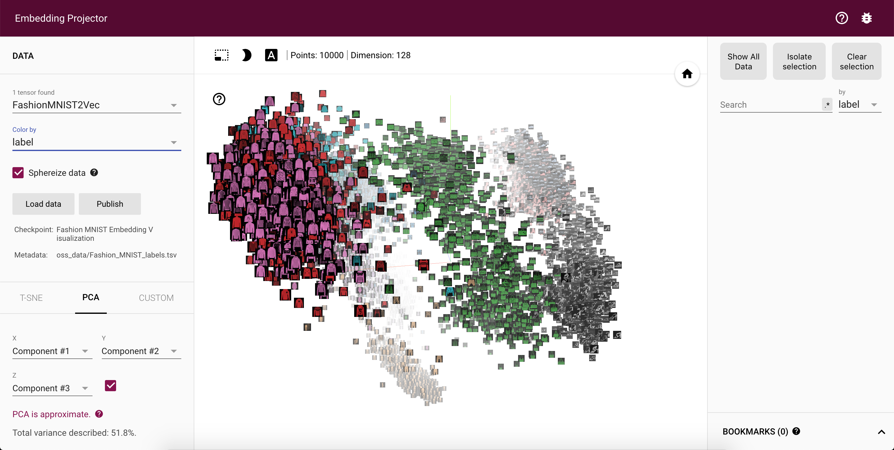

# Fashion-MNIST Embedding Visualization

* Create date: 2018-11-19

Fashion-MNIST Embedding Visualization using TensorFlow Projector


## Getting started

## The CNN model

* The model summary


* The training loss and accuracy


## Prerequisites

* numpy
* pickle
* scipy
* tensorflow==1.8
* keras
* sklearn
* Pillow
* matplotlib

Install the required packages by running the following command:

```bash
$ pip install -r requirements.txt
```

## Usage

1. Clone this repository

```bash
$ git clone https://github.com/sthanhng/Fashion-MNIST-Embedding-Visualization
```

2. Run the following commands:

```bash
$ cd Fashion-MNIST-Embedding-Visualization
$ python -m http.server
```

3. Navigate to the localhost server [http://127.0.0.1:8000/](http://127.0.0.1:8000/) to see the visualization.




> **Using t-SNE - [1792 iterations]**


## Reference

* TensorFlow Projector:

    + https://github.com/tensorflow/embedding-projector-standalone
    + https://projector.tensorflow.org/
    
* Fashion-MNIST with tf.Keras

    + https://medium.com/tensorflow/hello-deep-learning-fashion-mnist-with-keras-50fcff8cd74a


